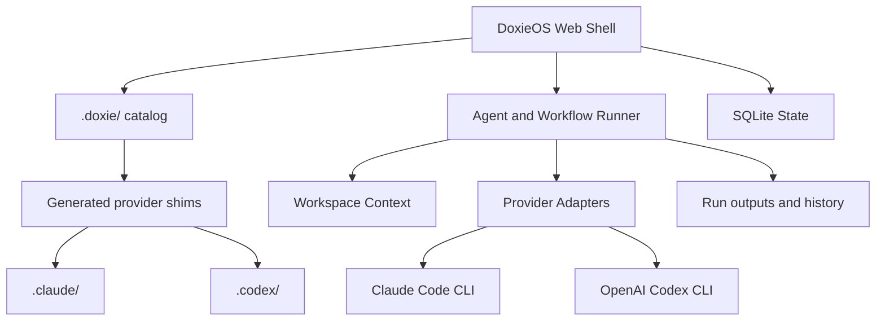

<p align="center">
  
</p>

# DoxieOS

[](https://github.com/viamus/DoxieOS/actions/workflows/ci.yml)
[](https://dotnet.microsoft.com/)
[](LICENSE)

DoxieOS is a local-first operating layer for AI-assisted engineering work. It
turns a developer machine into a control plane for agents, workflows,
workspaces, reusable memory, provider shims, live consoles, notifications, and
reviewable delivery.

Claude Code and OpenAI Codex are supported provider CLIs, but they are not the
product boundary. DoxieOS owns the canonical `.doxie/` catalog and emits
provider-specific compatibility files from that source of truth.

## What You Get

- A local web app for launching, observing, and reviewing agent work.
- A canonical `.doxie/` catalog for agents, workflows, libraries, and memories.
- Provider-neutral execution for Claude Code, OpenAI Codex, and future CLI-backed providers.
- Workspace-aware memory mounting for project standards and team context.
- Workflow orchestration for repeatable multi-agent delivery.
- Agent and workflow builders with draft previews and catalog promotion.
- Live consoles, run history, usage tracking, release notes, and notifications.
- MCP-aware settings for Claude/Codex config reconciliation.
- Docker Compose support for local containerized operation.

## Documentation

The full product documentation lives in [docs/](docs/README.md).

- [Concepts](docs/concepts.md)
- [Architecture](docs/architecture.md)
- [Authoring Agents And Workflows](docs/authoring-agents-and-workflows.md)
- [Operations Guide](docs/operations.md)
- [Licensing And Attribution](docs/licensing.md)

## Architecture At A Glance



## Run Locally

Install the .NET SDK pinned in [global.json](global.json), then run:

```bash
dotnet run --project src/Viamus.Doxie.Orchestrator
```

The app listens on `http://localhost:5034` by default.

Useful development commands:

```bash
dotnet restore Solution.slnx
dotnet build Solution.slnx
dotnet test Solution.slnx
```

## Run With Docker Compose

```bash
docker compose up --build
```

The default Compose profile exposes `http://localhost:6034`, bind-mounts the
canonical `.doxie/` catalog and `.private/` folder, and persists runtime state
plus provider auth in named Docker volumes.

Use another host port with:

```bash
DOXIE_HTTP_PORT=6134 docker compose up --build
```

If MCP servers run beside DoxieOS in Docker, use their Docker service names
instead of `localhost`. Host-machine MCP services can be reached from the
container with `host.docker.internal`.

## Repository Shape

```text
.
├── .doxie/                         # Canonical Doxie catalog
├── docs/                           # Product documentation
├── src/                            # .NET / Blazor application
├── tests/                          # Automated tests
├── docker-compose.yml              # Containerized local runtime
├── LICENSE                         # Apache License 2.0
└── NOTICE                          # Attribution notice for redistributions
```

Runtime folders such as `.workspace/`, `.sandbox/`, `.runs/`, local databases,
and private provider content are intentionally kept out of normal commits.

## Bundled Catalog

The bundled catalog includes:

- agent and workflow builders;
- Doxie library authoring;
- prompt, aggregate, loop, approval, and workspace output primitives;
- transient sandbox management for isolated agent scratch work.

## License

DoxieOS is licensed under the [Apache License 2.0](LICENSE) and ships with a
[NOTICE](NOTICE) file. The license keeps DoxieOS free to use while preserving
attribution and patent protections.

See [Licensing And Attribution](docs/licensing.md) for the project intent.

## Contributing

See [CONTRIBUTING.md](CONTRIBUTING.md) for setup, branch naming, review
conventions, and code style.

Quick version:

1. Branch from `main`.
2. Keep product/runtime changes separate from catalog/spec-only changes.
3. Edit canonical Doxie files under `.doxie/` when changing agents or workflows.
4. Run the narrowest useful validation locally.
5. Push and open a reviewable change.
