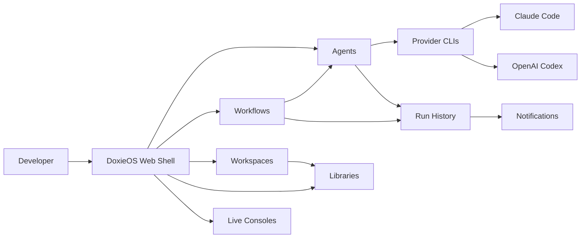

# DoxieOS Documentation

DoxieOS is a local-first operating layer for AI-assisted engineering work. It
keeps agent definitions, workflows, workspaces, libraries, provider shims, run
history, and local operational state close to the developer machine.

This folder is the product documentation entry point.

## Read First

- [Concepts](concepts.md): the product vocabulary and how the pieces relate.
- [Architecture](architecture.md): runtime boundaries, data flow, and provider compatibility.
- [Authoring Agents And Workflows](authoring-agents-and-workflows.md): how Doxie catalog assets are shaped.
- [Operations Guide](operations.md): running locally, Docker Compose, MCPs, storage, and validation.
- [Licensing And Attribution](licensing.md): why the project uses Apache-2.0 plus NOTICE.

## Product Map



## Repository Shape

```text
.
├── .doxie/                         # Canonical Doxie catalog
│   ├── skills/<id>/
│   ├── workflows/<id>/
│   └── libraries/<id>/
├── docs/                           # Product documentation
├── src/                            # .NET / Blazor application
├── tests/                          # Automated tests
├── docker-compose.yml              # Containerized local runtime
├── LICENSE                         # Apache License 2.0
└── NOTICE                          # Attribution notice for redistributions
```

## Documentation Rules

- Keep product documentation in this folder.
- Keep release-note markdown under `src/Viamus.Doxie.Orchestrator/docs/release-notes/` because those files are embedded in the app.
- Prefer diagrams for relationships, flows, and boundaries.
- Keep README concise; move durable explanations into `docs/`.
