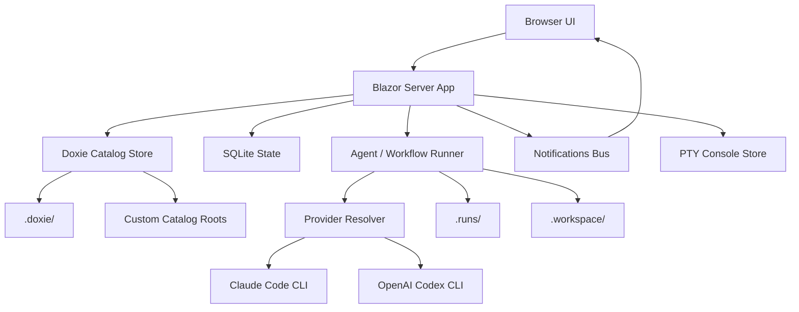
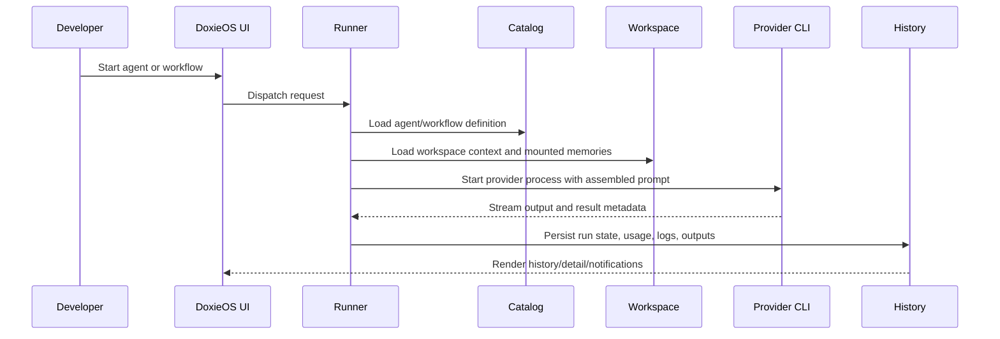
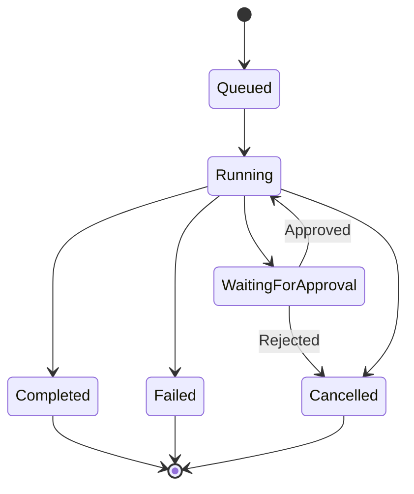
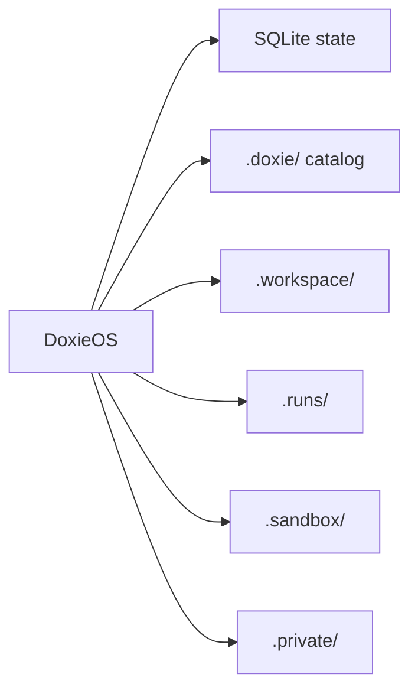
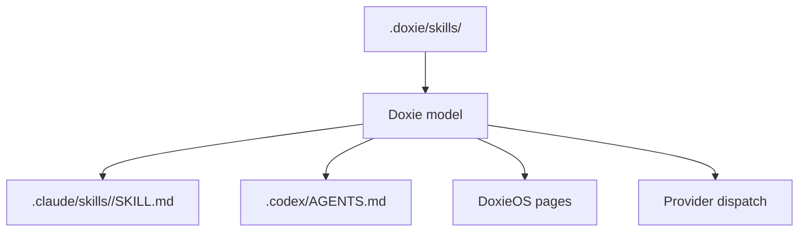

# Architecture

DoxieOS is a .NET / Blazor Server application with a canonical Doxie catalog,
provider-specific compatibility generation, local SQLite state, and CLI-backed
agent execution.

## System Overview

## Runtime Boundaries

| Boundary | Responsibility |
| --- | --- |
| UI | Pages, settings, builders, history, notifications, graph editing, release notes. |
| Agents | Catalog parsing, provider prompt assembly, run persistence, process lifecycle. |
| Workflows | Graph execution, node dispatch, trigger handling, output contracts. |
| Context | PTY/process abstractions and platform-specific child process control. |
| Storage | SQLite state, catalog roots, workspaces, sandboxes, run outputs. |

## Execution Flow

## Workflow Run States

## Storage Model

The canonical catalog should be versioned when assets are part of the product or
team workflow. Runtime output folders and private provider state should stay
local unless there is a deliberate reason to share them.

## Provider Compatibility

DoxieOS does not make Claude Code or Codex the source of truth. Instead, it emits
compatibility files from `.doxie/` so providers can run against the same catalog.

## Release Notes

App release notes are stored under
`src/Viamus.Doxie.Orchestrator/docs/release-notes/` because they are embedded in
the application assembly and shown in the release notes modal.
