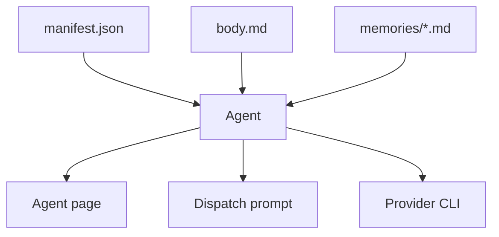
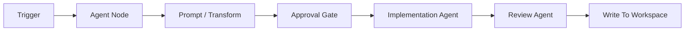
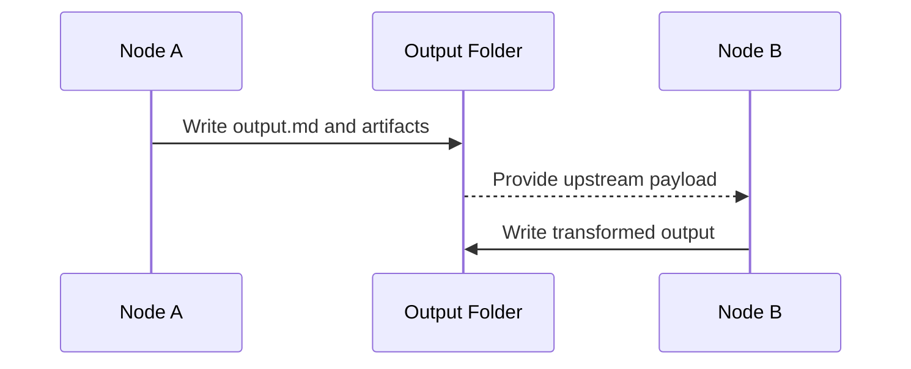
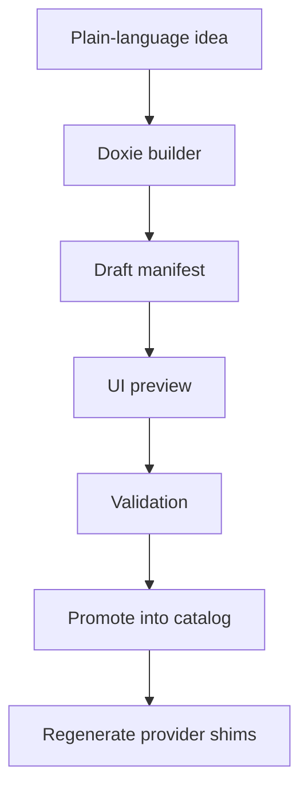

# Authoring Agents And Workflows

DoxieOS treats agents and workflows as product assets, not loose prompts. The
goal is to make them inspectable, reusable, and easy to review.

## Agent Shape

A Doxie agent lives under `.doxie/skills/<id>/` and normally contains:

```text
.doxie/skills/<id>/
├── manifest.json
├── body.md
└── memories/
    └── *.md
```

The manifest defines metadata, category, icon, inputs, requirements, modes, and
execution behavior. The body defines the operating instructions.



## Agent Authoring Guidelines

- Use kebab-case ids.
- Describe the job boundary before describing tools.
- Define what a successful output looks like.
- Include handoff expectations when another workflow node will consume the result.
- Keep provider-specific assumptions out of the core body unless the agent truly depends on them.
- Prefer workspace or library memories for reusable project context.

## Workflow Shape

A Doxie workflow lives under `.doxie/workflows/<id>/workflow.json`.

Workflows should describe:

- trigger type and enabled state;
- nodes and edges;
- agent ids or primitive connector ids;
- static inputs;
- output expectations;
- human approval points where needed.



## Built-In Workflow Primitives

| Primitive | Purpose |
| --- | --- |
| `prompt` | Transform, summarize, extract, or map data between nodes. |
| `aggregate` | Wait for multiple upstream nodes and merge their outputs. |
| `loop` | Iterate over array-shaped input with controlled concurrency. |
| `if-else` | Evaluate upstream JSON and route only the selected `true` or `false` edge. |
| `approval-gate` | Pause until a human approves or rejects. |
| `write-to-workspace` | Deliver final markdown output into a workspace. |

Conditional workflow edges use the optional `condition` property. Edges leaving
an `if-else` node normally set `"condition": "true"` or `"condition": "false"`;
unconditioned edges still behave as regular dependencies.

## Output Contracts

Workflow nodes should leave durable output. Terminal text is useful for live
inspection, but downstream nodes need files or structured payloads.



## Builder Flow

The agent and workflow builders create drafts in sandboxes, render live previews,
and promote valid definitions into the selected catalog.


