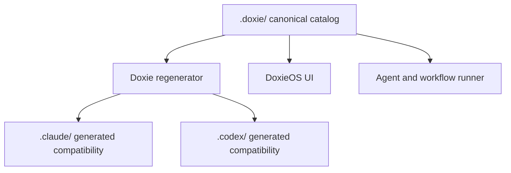
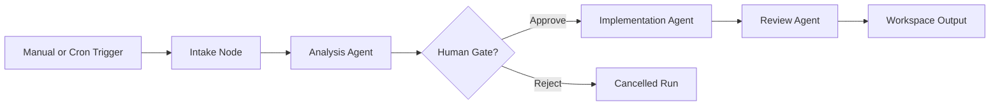
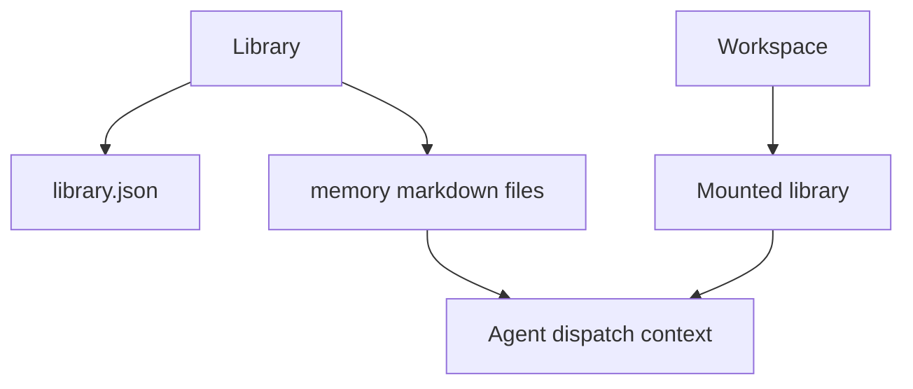

# Concepts

DoxieOS is built around a small set of durable concepts. The UI can evolve, but
these concepts define the product model.

## Core Objects

| Concept | What It Means | Stored In |
| --- | --- | --- |
| Agent | A runnable Doxie skill with metadata, body, inputs, requirements, and output expectations. | `.doxie/skills/<id>/` |
| Workflow | A graph of agent and connector nodes that turns repeatable work into an inspectable run. | `.doxie/workflows/<id>/workflow.json` |
| Library | A reusable memory pack mounted into workspaces or dispatched agents. | `.doxie/libraries/<id>/` |
| Workspace | A persistent project folder where agents can read context and write artifacts. | `.workspace/` by default |
| Catalog | A root folder containing Doxie skills, workflows, and libraries. | `.doxie/` or custom catalog folders |
| Provider | A CLI-backed execution target such as Claude Code or OpenAI Codex. | App settings and provider config |
| Run | A persisted execution record for an agent or workflow. | SQLite state and run output folders |

## Canonical Versus Generated

`.doxie/` is the source of truth. Provider-specific folders are compatibility
outputs so current CLIs can consume Doxie-authored assets.

## Agents

An agent is the smallest reusable unit of Doxie work. It should define:

- what the agent is responsible for;
- what inputs it accepts;
- which tools or external systems it needs;
- what output another human or workflow node can consume;
- when it should stop and ask for help.

Agents can be advisory, implementation-oriented, operational, workflow
primitive, or handoff-focused.

## Workflows

A workflow is a graph. It can run manually, on cron, or from persisted trigger
definitions that will be wired later.

## Workspaces

Workspaces make agent work less generic. They can hold project context,
workspace memories, mounted libraries, generated outputs, and handoff artifacts.

When a workspace is selected, DoxieOS can inject:

- `WORKSPACE.md`;
- workspace `memory/*.md`;
- mounted library memories;
- operator hints collected during a run.

## Libraries

Libraries are reusable memory packs. They are useful for standards, design
systems, delivery playbooks, privacy rules, vendor integration notes, and team
ways of working.

## Providers

DoxieOS is provider-neutral. It prepares the run context and dispatches to the
selected provider CLI. Provider compatibility is intentionally an adapter layer,
not the product model.

Supported provider families currently include Claude Code and OpenAI Codex.
