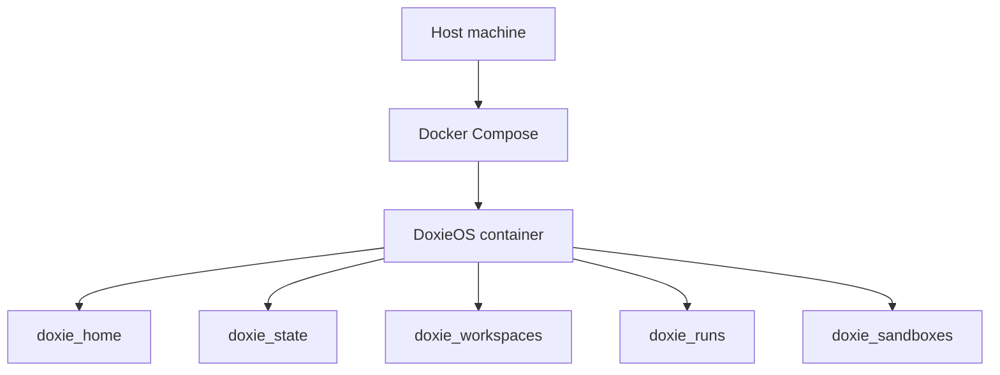
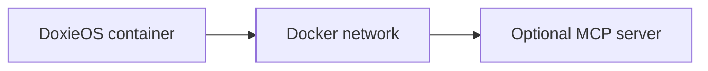
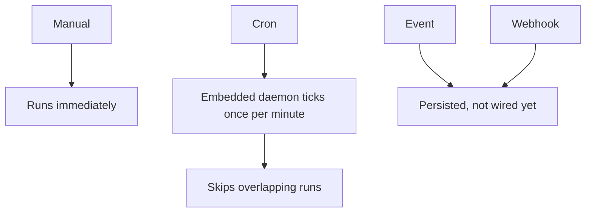

# Operations Guide

This guide covers local operation, Docker Compose, MCP configuration, storage,
and validation.

## Local Development

Install the .NET SDK pinned in `global.json`.

```bash
dotnet restore Solution.slnx
dotnet build Solution.slnx
dotnet test Solution.slnx
dotnet run --project src/Viamus.Doxie.Orchestrator
```

The app listens on `http://localhost:5034` by default in local development.

## Docker Compose

```bash
docker compose up --build
```

The default Compose setup exposes DoxieOS on host port `6034` and keeps state in
named volumes.



Use `DOXIE_HTTP_PORT` to expose a different host port:

```bash
DOXIE_HTTP_PORT=6134 docker compose up --build
```

## MCP Servers

DoxieOS can reconcile MCP server definitions from Claude and Codex provider
configs into durable app state. When DoxieOS runs in Docker and an MCP server
runs in another container, use Docker service names instead of `localhost`.



For host-machine services, use `host.docker.internal` from inside the container.

## Storage

| Path | Purpose | Usually Committed? |
| --- | --- | --- |
| `.doxie/` | Canonical catalog. | Yes, for shared assets. |
| `.private/` | Private local provider or work content. | No. |
| `.workspace/` | User-owned workspaces. | No by default. |
| `.runs/` | Workflow and agent run outputs. | No by default. |
| `.sandbox/` | Temporary scratch work. | No. |
| SQLite state | Runtime app state. | No. |

## Triggers



Manual triggers run immediately. Cron triggers fire from a daemon embedded in
DoxieOS. The daemon only fires enabled workflows and skips overlapping runs.
Crons stop when DoxieOS is not running.

## Validation

Use the narrowest validation that proves the change:

```bash
dotnet build Solution.slnx
dotnet test Solution.slnx
```

For frontend changes, also run the app and verify the affected route in the
browser.
